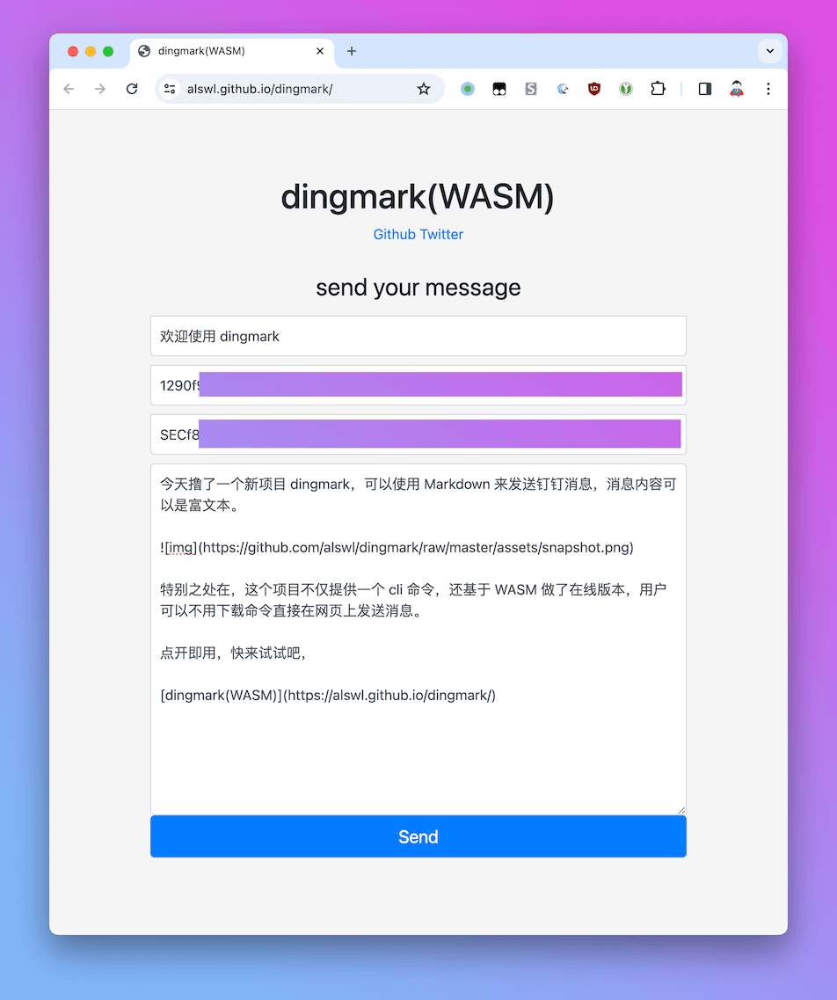

# dingmark

Go cli and WASM online for DingTalk send markdown message

## Usage

Send markdown:

```bash
dingmark send \
    --token 129xxxxxxxxxxxxxxxxxxxxxxxxxxxxxxxxxxxxxxxxxxxxxxxxxxxxxxxxxxxf7 \
    --secret SECf8exxxxxxxxxxxxxxxxxxxxxxxxxxxxxxxxxxxxxxxxxxxxxxxxxxxxxxxxxx670 \
    "欢迎使用 dingmark" \
    '今天撸了一个新项目 dingmark，可以使用 Markdown 来发送钉钉消息，消息内容可以是富文本。 特别之处在，这个项目不仅提供一个 cli 命令，还基于 WASM 做了在线版本，用户可以不用下载命令直接在网页上发送消息。 点开即用，快来试试吧，[alswl.github.io/dingmark](https://alswl.github.io/dingmark) 。'
```

More:

```bash
dingmark -h
Usage:
  dingmark [command]

Available Commands:
  completion  Generate the autocompletion script for the specified shell
  help        Help about any command
  send        

Flags:
      --config string   config file (default is $HOME/.config/dingmark.yaml)
  -h, --help            help for dingmark
      --secret string   secret
      --token string    token
  -v, --version         version for dingmark

Use "dingmark [command] --help" for more information about a command.
```

Document: [alswl/dingmark/docs](https://github.com/alswl/dingmark/blob/master/docs/dingmark.md)

## Snapshot


